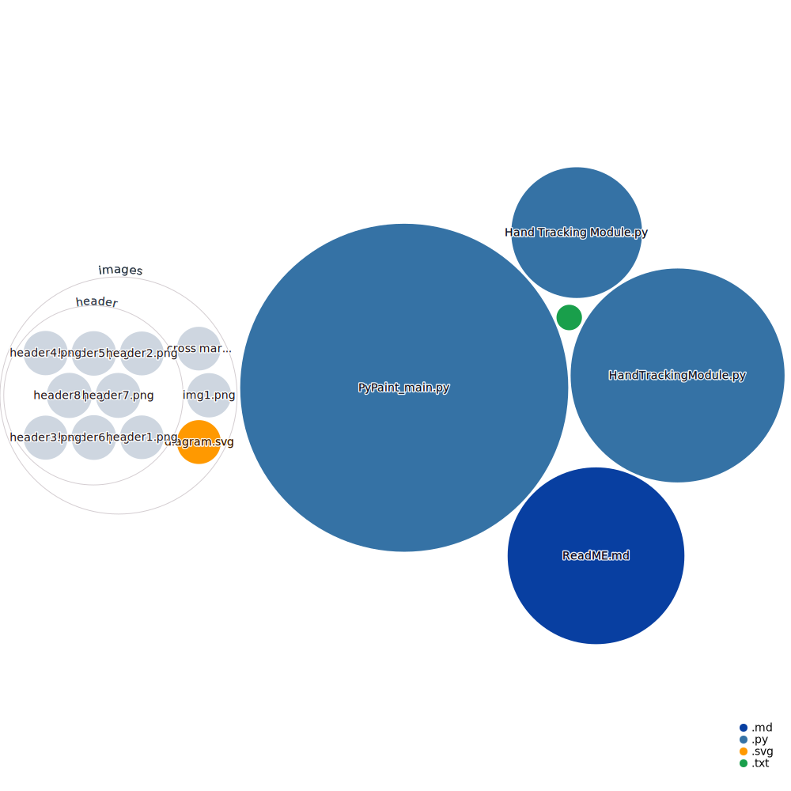

# PyPaint

PyPaint is an interactive drawing application that uses computer vision to track hand movements and gestures. The application allows users to draw on a virtual canvas using different colors and an eraser tool, all controlled by hand gestures detected through a webcam.

## Features

- Hand gesture recognition using MediaPipe
- Drawing with different colors
- Eraser tool for removing parts of the drawing
- Real-time video feed with overlayed drawing canvas

## Updates on original project

- Added a new feature to close the window by showing two fingers like we select colours.
- Changed the colour palette to VIBGYOR
- Handled Keyboard interrupt (ctrl+c) to close the window.

## Requirements

- Python 3
- OpenCV
- NumPy
- MediaPipe

## Installation

1. Clone the repository:
   ```git clone https://github.com/kittupriyatham/PyPaint.git```
2. Change directory:
    ```cd PyPaint```
3. Install the required packages:
   ```pip install -r requirements.txt```
4. Run the application:
   ```python pypaint.py```
    Press `ctrl+c` to exit the application. 
5. Use the following hand gestures to control the application:
   - One Finger: Draw
   - Two Fingers: Change color/eraser / Close window.

## How It Works

The application captures video from the webcam and uses MediaPipe to detect hand landmarks. Based on the position of the fingers, it determines whether the user is in drawing mode or selection mode. Users can select different colors or the eraser by moving their hand to specific areas on the screen.

## Repo Visualisation


## Project Visuals


